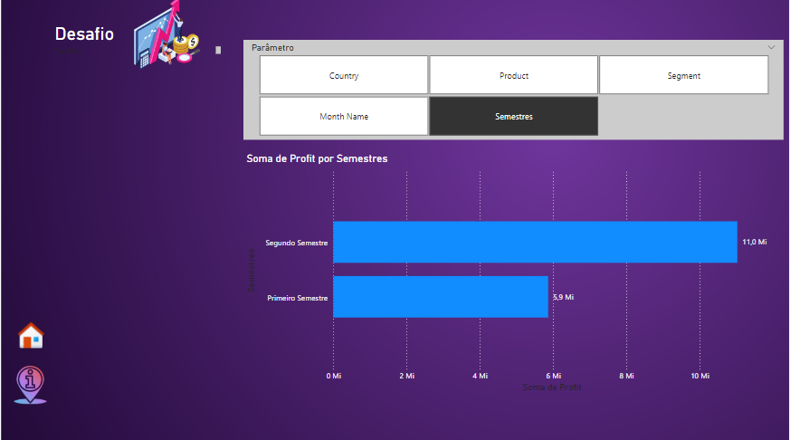

# Desafio Power BI - Módulo 6 DIO - Parâmetros

No desafio "Criando Relatórios Dinâmicos com o uso de Parâmetros no Power BI"
do módulo "Gerenciamento de Workspaces e Datasets com Power BI" do Bootcamp "Data Analytics com Power BI" foi acrescentado um novo relatório em um dos arquivos feitos em desafios anteriores..

Foi criado um relatório para aplicar os conceitos de parâmetros e formatação condicional

O relatório ficou da seguinte forma:

Neste repositório se encontra o arquivo do Power Bi com o desafio.
